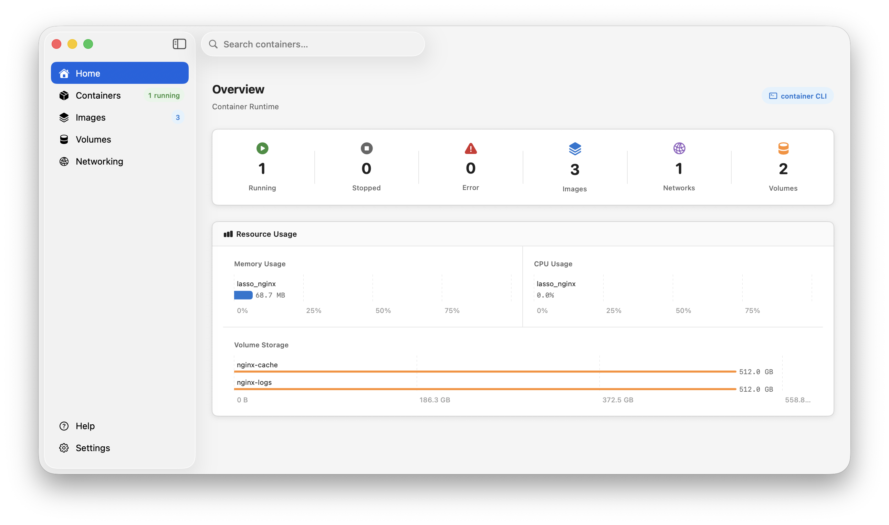

# CoreLasso

A native macOS application for managing Apple containers, built with SwiftUI and Apple's Virtualization framework. CoreLasso provides a clean graphical interface for the Apple `container` CLI, with full Docker Compose support via the bundled `lasso` CLI.

  



---

## Overview

CoreLasso wraps the Apple `container` CLI in a native SwiftUI interface, making it straightforward to manage containers, images, volumes, and networks from the desktop. It also ships a companion CLI tool (`lasso`) that adds Docker Compose orchestration on top of the Apple container runtime.

---

## Features

- **Container lifecycle management** - Create, start, stop, kill, delete, and export containers from a unified dashboard
- **Image management** - Pull from Docker Hub and OCI-compatible registries with live progress tracking
- **Volume and network management** - Create, inspect, and remove volumes and virtual networks
- **Real-time dashboard** - Live container state with running count, resource visibility, and quick actions
- **Material Design UI** - Clean, native macOS interface with sidebar navigation and contextual detail panels
- **Docker Compose support** - Run multi-container workloads from existing `docker-compose.yml` files via the `lasso` CLI
- **Dockerfile support** - Build and run single containers directly from a Dockerfile via `lasso build` / `lasso up`
- **OCI-compatible** - Interoperable with Docker Hub, GHCR, ECR, GCR, and any OCI registry

---

## Requirements

| Requirement | Version |
|-------------|----------|
| macOS | 15.0 Sequoia or later |
| Swift | 6.0 |
| Xcode | 16.0 or later |
| Apple `container` CLI | Required for real container operations |

> The `container` CLI must be installed separately. Run `container system start` once to bootstrap the Apple Virtualization kernel and system services.

---

## Getting Started

```bash
git clone https://github.com/RXNova/CoreLasso.git
cd CoreLasso
swift run CoreLassoApp
```

The app auto-detects the available backend:

- If the Apple Virtualization kernel is installed, it uses it directly
- Otherwise it falls back to the `container` CLI

---

## Building

```bash
# Debug build
swift build

# Release build
swift build -c release
```

---

## lasso CLI

`lasso` is a companion CLI tool bundled with CoreLasso. It wraps the Apple `container` CLI with Docker Compose orchestration and Dockerfile shortcuts.

### Installation

```bash
swift build -c release
cp .build/release/lasso /usr/local/bin/lasso
```

### Commands

| Command | Description |
|---------|-------------|
| `lasso up` | Start services from `docker-compose.yml` in the current directory |
| `lasso up -f <file>` | Start services from a specific compose file |
| `lasso up -p <name>` | Use a custom project name (default: `lasso`) |
| `lasso up -f Dockerfile` | Build and run a single container from a Dockerfile |
| `lasso down` | Stop and remove all containers for the project |
| `lasso down -p <name>` | Stop and remove a named project |
| `lasso build -t <tag> [ctx]` | Build an OCI image from a Dockerfile |
| `lasso ps` | List running containers |
| `lasso help` | Show CLI usage |

### Docker Compose Support

`lasso up` reads standard compose files and translates each service into a native Apple container. Supported filenames (auto-detected in order): `docker-compose.yml`, `docker-compose.yaml`, `compose.yml`, `compose.yaml`.

**Supported fields:** `image`, `build`, `ports`, `volumes`, `environment`, `networks`, `command`, `entrypoint`, `working_dir`, `cpus`, `mem_limit`

Containers are named `<project>_<service>`. `lasso down` stops and removes them by the same convention.

### Examples

```bash
# Start all services from docker-compose.yml in the current directory
lasso up

# Start with a custom project name
lasso up -f myapp/docker-compose.yml -p myapp

# Build and run a single Dockerfile
lasso up -f Dockerfile

# Stop and remove the default project
lasso down

# Stop and remove a named project
lasso down -p myapp

# Build an image
lasso build -t myapp:latest .
```

---

## Docker Compatibility

CoreLasso uses the OCI image format, making it interoperable with the broader Docker ecosystem:

- Standard Dockerfiles work without modification with `lasso build` / `container build`
- Images are compatible with Docker Hub, GHCR, ECR, GCR, and any OCI registry
- `linux/arm64` images run natively on Apple Silicon with no emulation required

---

## Architecture

```
CoreLasso/
├── LassoCore          # Models, protocols, errors - no UI or framework dependencies
│   ├── Models/        # ContainerInfo, LassoSpec, NetworkSpec, ResourceSpec
│   ├── Protocols/     # LassoContainerEngine, RegistryService
│   ├── Parsing/       # LassoSpecParser
│   └── Errors/        # LassoEngineError, RegistryError
│
├── LassoData          # Engine and registry implementations
│   ├── Engine/        # VZContainerEngine (Virtualization.framework)
│   ├── Mocks/         # MockContainerEngine (no entitlements required)
│   └── Registry/      # OCIRegistryClient
│
├── LassoUI            # SwiftUI views, view models, design tokens
│   ├── Views/         # DashboardView, ContainerDetailView, ContainersView, HelpView
│   ├── ViewModels/    # DashboardViewModel, ContainerDetailViewModel, CreateContainerViewModel
│   ├── Components/    # StatusBadge
│   ├── Styles/        # GlassButtonStyle
│   ├── DesignTokens/  # LassoTokens (Material Design color and spacing system)
│   └── Resources/     # Help.md
│
├── CoreLassoApp       # Executable entry point
└── LassoCLI           # lasso CLI entry point and commands
```

---

## License

MIT


---

## Features

- **Container lifecycle** — create, start, stop, kill, and delete containers
- **Docker Desktop–style UI** — sidebar navigation, resizable table columns, hover-reveal action buttons
- **Port mappings** — expose host↔guest ports with TCP/UDP labels and IP display
- **OCI registry client** — pull images from Docker Hub and compatible registries
- **Ant Design token system** — consistent color/spacing tokens across all UI components

## Architecture

```
CoreLasso/
├── LassoCore          # Models, protocols, errors — no framework dependencies
│   ├── Models/        # ContainerInfo, LassoSpec, NetworkSpec, ResourceSpec, …
│   ├── Protocols/     # LassoContainerEngine, RegistryService
│   ├── Parsing/       # LassoSpecParser (JSON → LassoSpec)
│   └── Errors/        # LassoEngineError, RegistryError
│
├── LassoData          # Engine implementations
│   ├── Engine/        # VZContainerEngine (Virtualization.framework)
│   ├── Mocks/         # MockContainerEngine (in-memory, no entitlements)
│   └── Registry/      # OCIRegistryClient (Docker Hub / OCI registries)
│
├── LassoUI            # SwiftUI views and view models
│   ├── Views/         # DashboardView, ContainerDetailView, CreateContainerView
│   ├── ViewModels/    # DashboardViewModel, ContainerDetailViewModel, CreateContainerViewModel
│   ├── Components/    # StatusBadge, PowerProfileIndicator
│   ├── Styles/        # GlassButtonStyle
│   └── DesignTokens/  # LassoTokens (Ant Design color/spacing system)
│
└── CoreLassoApp       # Executable entry point (main.swift)
```

## Requirements

| Requirement | Version |
|---|---|
| macOS | 15.0 (Sequoia) or later |
| Swift | 6.0 |
| Xcode | 16.0 or later |

> **Note:** Running real containers requires the `com.apple.security.virtualization` entitlement. The included `MockContainerEngine` works without any entitlements and is used by default for development.

## Getting Started

```bash
git clone https://github.com/RXNova/CoreLasso.git
cd CoreLasso
swift run CoreLassoApp
```

The app launches with 5 pre-seeded mock containers (postgres, redis, nginx, node, python) so you can explore the UI immediately without any VM entitlements.

## Building

```bash
# Debug build
swift build

# Release build
swift build -c release
```

## License

MIT
